<h1 align="center"></h1>
<p align="center">Extra nodes for ComfyUI, from the Winteraction workbench.</p>

<p align="center">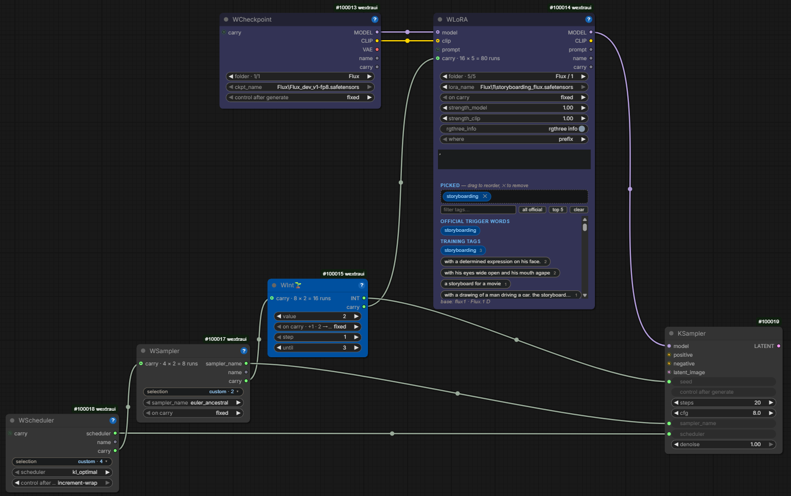</p>

**Time works for you.**

WextraUI dresses ComfyUI as a production machine that never stops, and we mean it literally. A collection of custom nodes born from everyday needs.

In a world that runs hyper-fast, ComfyUI is still young as we write this (2026). Yet it does not seem to feel the friction of time: technical evolution and the open-source community make it take huge steps forward in a short while. What sometimes frustrated those who, like us, like to know how every single gear works, was not being able to automate certain trials: generating and comparing many variations by model, LoRA, seed, steps, cfg, but also sampler or scheduler. Until yesterday, changing any one of these parameters (seed apart) meant one or more separate runs.

The respective WextraUI utility nodes have a control after generate like the classic one of the seed, and by chaining their `carry` backwards, when the first node finishes its list it moves the second by one, like the digits of an analogue counter. So a grid of scheduler × sampler × seed × LoRA × checkpoint can be queued (machine permitting) with one press of Run. And our WSave Image can write into the name of every file the values that produced it, so you never reopen anything to see what you had tried, or, thanks to WDifference, the differences from the previous run.

It is not new magic, it is the same magic as ComfyUI: only the time of repetitive trials given back to whoever uses it, to spend looking at the results and making wonders.

There are other nodes in the pack, like the ones that build the sequence of scenes with continuous audio for MiniMax H3. Every node is documented below, one by one, and every node has a `?` with its help page, readable right on the graph.

We hope they are as useful to you as they are to us. And by us we mean me and the AI (frontier or open-source), which can drive these nodes like any other in ComfyUI, through CLI or MCP.

Time is no tyrant. You only need to make it work for you.

## Install

ComfyUI Manager: search **WextraUI**. Or clone it into your custom nodes:

```
cd ComfyUI/custom_nodes
git clone https://github.com/sickbraintwo/WextraUI
```

No extra dependencies. Restart ComfyUI; the nodes are in the **WextraUI** category.

<p align="center"></p>
<p align="center"><sub>Every node has a <b>?</b> in its title bar: the full help page, inside ComfyUI. This README is the tour, the <b>?</b> is the manual.</sub></p>

The nodes work on the classic canvas (the default) and with the **Nodes 2.0** renderer (`Comfy.VueNodes.Enabled`): the `?`, the buttons and bars, the pills of WSwitch, the `+` chips and the row bars of WPrompt Rows are there in both. Switching Nodes 2.0 off gives every WextraUI node its classic size back (Nodes 2.0 draws taller rows and writes that height into the node). The pictures below are from the classic canvas.

## The nodes

| Utilities | | H3 scene loop | |
|---|---|---|---|
| [WSave Image](#wsave-image) | the file name says what made the image | [WSimple Prompt H3](#wsimple-prompt-h3) | prompt without time-codes |
| [WPrompt Rows](#wprompt-rows) | the prompt as rows you switch on and off | [WScene Composer H3](#wscene-composer-h3) | storyboard → time-coded prompt |
| [WRoute](#wroute--wroute-index) | the *if* that picks an output | [WScene H3](#wscene-h3) | one scene as one object |
| [WRoute Index](#wroute--wroute-index) | same, by number | [WScenes Collection H3](#wscenes-collection-h3) | the scenes, in order |
| [WDifference](#wdifference) | what changed since the last run | [WLoop Start H3](#wloop-start-h3) | which scenes this Run renders |
| [WLoRA](#wlora) | LoRA + trigger words, in line | [WLoop Scene Conditioning H3](#wloop-scene-conditioning-h3) | the loop body |
| [WFrame](#wframe) | crop · resize · place, for outpaint | [WLoop End H3](#wloop-end-h3) | the hand-off to the next scene |
| [WFloat](#wfloat) | a float that walks, run after run | | |
| [WInt🌱](#wint) | an integer that walks: the seeds of a grid, a count | | |
| [WSwitch](#wswitch) | slots of cables, one on, the rest asleep | | |
| [WCheckpoint](#wcheckpoint) | Load Checkpoint + folder + control after generate | | |
| [WSampler](#wsampler--wscheduler) | the sampler menu + control after generate | | |
| [WScheduler](#wsampler--wscheduler) | the scheduler menu + control after generate | | |
| [carry](#carry-the-odometer-cable) | the cable that makes a grid of two walks | | |

## Utilities

### WSave Image

Saves the PNGs and writes into the name of every file what made it. The name is **composed from parts**: folder, subject, any string or number from the graph, a counter of chosen width; the usual ComfyUI metadata go inside. The `preview` box shows the name before you run, linked fields included. `images` is optional: unplugged, the node only composes the name for other savers (video, JSON). The `images` output passes the batch through, so the save sits inside the chain instead of at a dead end.

Above each part a slim bar (`part 1`, `part 2`…) has two chips: `−` removes that part, `+` opens an empty one right below; values and cables follow. The **write batch** switch appends `_B{batch}{index}`: how many images the run made and which one this is (`_B41`, `_B42`…); the same placeholders work in any text field.

**`{#id}`** in any text is the value that WextraUI node used in this run (WSampler, WScheduler, WCheckpoint, WLoRA, WFloat, WInt🌱, WSwitch), no cable. **`from Wnodes on graph`** lists the nodes of the workflow by name, the ones that walk already ticked, in the order of the carry chain, and makes one part for each (`WSampler = euler` in the name, value locked to the node). A grid of trials, and every file telling on its own what made it.

 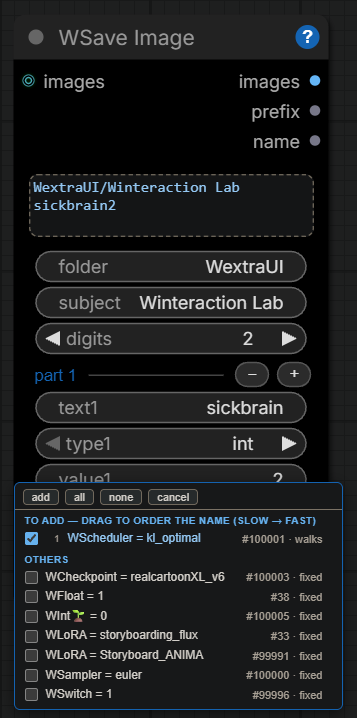

### WPrompt Rows

The prompt as **rows**. Each one is a text area that grows with the text, with an **on/off** chip and a socket on the left for an external string (trigger words, another prompt) that the same chip switches. **+** adds a row, **−** removes one. The rows that are on come out joined by `, `, a space, a new line or nothing.

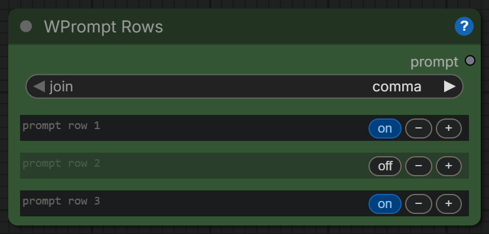

### WRoute · WRoute Index

The **if the other way round**: one input, two outputs, a boolean decides which output carries the value. The branch not chosen **does not run at all**, Save nodes included. `WRoute Index` does the same with a number: up to twenty outputs, counted from 0, shown as you use them. The `index` of WSwitch fits as it is.

 

<details><summary>Why it exists, and how to join the branches again</summary>

Nearly every switch in the ecosystem picks an *input*, because ComfyUI is pull-based; this one picks the *output* (`ExecutionBlocker` on the branch not taken). To join the branches back into one Save node use a **lazy** switch fed by the same boolean (core *If/Else Switch*, Easy-Use *if-else*). A non-lazy if (ComfyUI-Logic *If*) evaluates both inputs, meets the blocker and is skipped with everything after it: no error, no file.
</details>

### WDifference

Tells you **what you changed since the previous run** of this workflow: seeds, prompts, widget values, rewiring, nodes added or removed. As text, one line per change, and as a file-name-safe `tag`. Every node, or only the ones in `track`: select them on the canvas and press `add` (`remove` takes them out); `ignore` silences a node or a single widget (`74.seed`). A week later the file still says what that run changed.


<details><summary>How it works</summary>

It reads the hidden PROMPT that every Save node embeds in the file, keeps the previous run per workflow on disk and returns the differences: `~ Composer I-a (#74) · seed: 2 → 6`, rewiring, nodes added/removed. Optional `.log` = a run diary for free (`output/_Wextra/rundiff/`). `changes` (short, file-name safe: `74.seed→6_12.strength→0.6`) or `tag` (`246.strength=0.4_57.seed=77`, `first`, `same`; display-only widgets ignored) as a string part in WSave Image, and the file name tells you what that run changed; the readable diff is in the `.log`.
</details>

### WLoRA

Loads the LoRA **and** puts the trigger words you click into your prompt, in one node, in line: the prompt cable goes in on one side and comes out on the other with the words already in it. The words come from the `<lora>.rgthree-info.json` that rgthree-comfy saves next to a LoRA (the official words, `rgthree_info` switch) and from the training tags inside the file: click the chips, drag to reorder.

Above the name, **`folder`** narrows the LoRA menu to one folder (any depth) and shows where you are in it (`folder · 3/12` = runs to queue). Under the name, the seed-style **control after generate** (`increment` / `decrement` / `randomize`) walks the LoRAs of that folder across queued runs. For a strength that walks, cable a [WFloat](#wfloat) on `strength_model` (and on `strength_clip`). The walk lives in the node, but `folder` is a real input (in `object_info`, optional), so a script reading the saved workflow sees the same values you see.

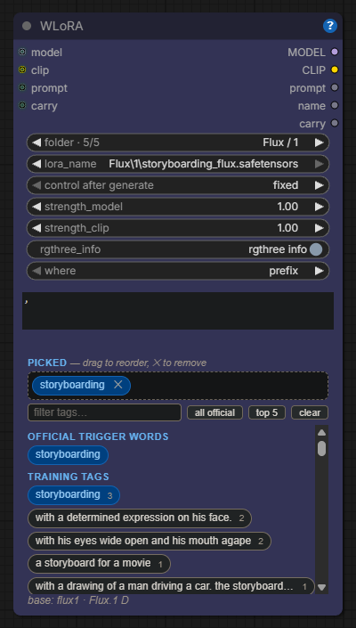

### WCheckpoint

The core Load Checkpoint with the same two things as the LoRA loader. **`folder`** above the name: the folders of your checkpoint list at any depth, and the label shows where you are (`folder · 3/12` = runs to queue). The seed-style **control after generate** under it: `increment` / `decrement` / `randomize` walk the checkpoints of that folder across queued runs. Same load as the core node (`MODEL`, `CLIP`, `VAE`, same caching), plus **`name`** as a string for [WSave Image](#wsave-image): one prompt, one seed, every model of a family in one go, and each file says which model made it. `folder` is a real input (optional, in `object_info`); a folder that is gone never stops a run.

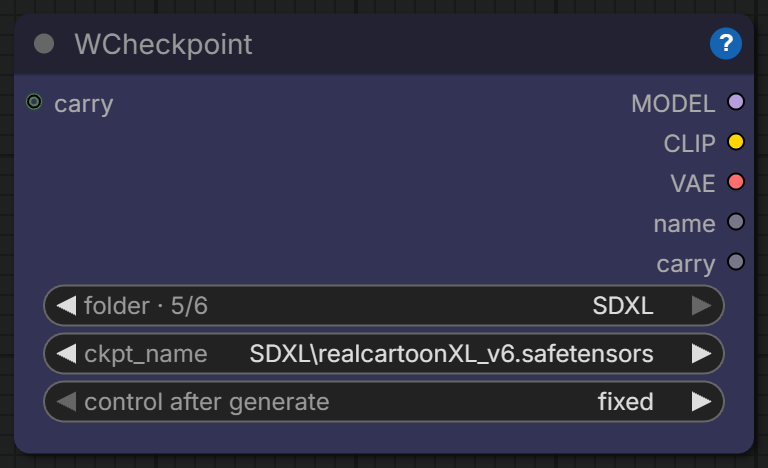

### WSampler · WScheduler

The `sampler_name` and `scheduler` menus as nodes of their own. Each has a **selection** drop-down above the name (`all`, or tick the names you want, drag them into order, and it reads `custom · n`: from then on the menu, the arrows and the walk only meet those names) and the seed-style **control after generate** under it. Turn the KSampler's `sampler_name` (or `scheduler`) into an input and cable the node into it: queue several runs with `increment` and each one takes the next name of the list. Both give the name as a string too, for [WSave Image](#wsave-image): one prompt, one seed, every sampler, and each file says what made it.

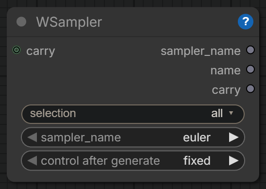 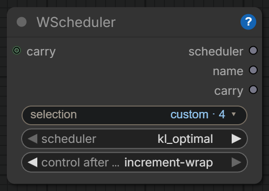 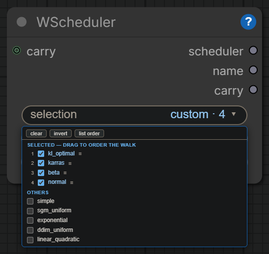

### WFrame

One node for the outpaint prep and every framing job. **`new_width` × `new_height` on top is the master**. Then crop (an aspect or custom), resize (fit, cover, long side, short side, or a number) and place on the canvas by anchor and offset: what is missing is padded, what sticks out is cut. Out come the picture, the pad **mask** feathered inward (ready for outpaint), the final size and a short text of what was done.


### WFloat

A float with a seed-style control: `fixed`, or `increment` / `decrement` by `step` after every queued run, with no arrival and no floor (negative values are legitimate). The label of `control` shows the step and its direction (`+0.1/run` / `−0.1/run`). For any FLOAT input: a strength through Set/Get, a denoise, a CFG. With a [`carry`](#carry-the-odometer-cable) cable in or out it is a wheel, from the value you set to `until`; without a cable `until` does nothing.

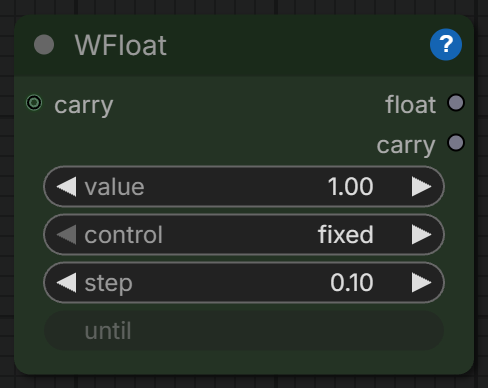

### WInt🌱

WFloat on an integer, with `randomize` too: a seed that walks by `step` (1 by default) after every queued run, for the KSampler's `seed` turned into an input or any INT. With a [`carry`](#carry-the-odometer-cable) cable it is a wheel from the value you set to `until`, four seeds for every sampler, the seeds inside, and its beat drives the next node.

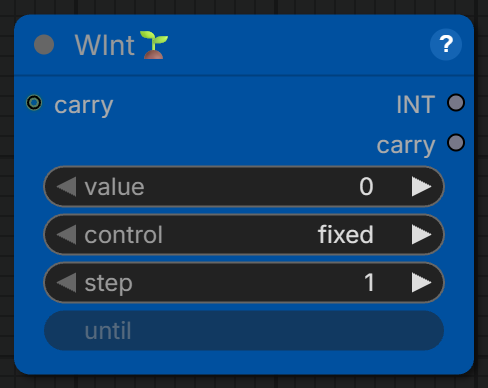

### WSwitch

A switch with **slots**. A slot holds `inputs_per_slot` cables of any type (3 = model, clip, vae); the slot that is **on** goes out, position by position (`out_1` = the first cable of the slot, `out_2` the second…). One on/off pill per slot, next to its first cable: click one and the others go off. One slot is always on. Connect a cable to the last slot and an empty one appears below (up to 20).

The **type of every position is learned from the first cable** you connect there: the same position of every slot and the output take it, the socket gets its colour and refuses another type. The cables of the slots that are off are lazy: **the branches behind them do not run** (no VRAM, no seconds). The first output, **`index`**, is the slot that is on, counted like an array (0 = the first): cable it to whatever must follow the same choice (WRoute Index grows to match it). Set `inputs_per_slot` before wiring: changing it reshapes the slots and the cables of the positions that disappear are dropped.

WSwitch walks too: with `control` on `increment` the slot that is on moves to the next one in use after every queued run, and the **`carry`** cable drives it or is driven by it, like the other nodes that walk. In WSave Image `{#id}` of a WSwitch is the slot that is on.

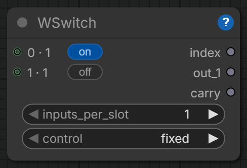

### carry: the odometer cable

Every node that walks (WSampler, WScheduler, WCheckpoint, WLoRA, WFloat, WInt🌱, WSwitch) has a **`carry`** input and output. Two of them, one inside the other: `carry` out of the fast one, into the slow one. Put the fast node on `increment-wrap`: each time it comes back from the last name to the first it sends one beat down the cable, and the slow node moves one step of its own (its control reads `on carry`; leave it on `fixed`). Like the digits of an analogue counter.

Chain as many as you like. WScheduler → WSampler → WCheckpoint is every checkpoint of a folder × every sampler × every scheduler of a selection, and the label of the input counts the runs: `carry · 3 × 4 = 12 runs`. Put 12 in the queue and the grid makes itself, with `name` of each node in the file name so every image says what made it. A WFloat on the cfg driven by the sampler: every sampler at 5, then every sampler at 5.5. A WInt🌱 with `until` as the first wheel: four seeds for every sampler.

The cable may pass through Set / Get and Reroute. It passes a string, and the backend, comfy-cli or an agent see an ordinary link: the beats happen in the interface, between one queued run and the next, where the walk already lives.

## H3 scene loop

A film for MiniMax H3 Sync Sound as a **list of scenes rendered one after the other**, each clip joined to the previous one by a hand-off of frames and audio. You describe the scenes; the loop renders them, resumes from any point, and lets every scene choose how it joins the one before.

<details><summary>How the hand-off works</summary>

Each **WScene H3** says how it joins the previous one: `handoff_frames` (last N frames + N/24 s of audio of the previous clip anchored at frame 0; valid H3 lengths 5/22/39/56…, 22 = 0.92 s default; longer = more music continuity across the join, more of the previous clip repeated), `previous_from` = `loop` (the clip rendered just before in the same run) or `file` + `resume_from_video` (scene-by-scene work: any clip as the previous one, scene 0 included, so a piece can start from the tail of any video). **WLoop End H3** sits at the end of the loop body and cuts the tail the *next* scene asks for; **WLoop Start H3** only chooses `start_scene` / `scene_count`. A run can therefore mix hand-off lengths per scene and resume anywhere.
</details>

### WSimple Prompt H3

The H3 prompt **without time-codes**: what we see, what happens in order, then the things an H3 prompt must always carry. One camera idea (a still camera said in full), the sound born with the picture, what stays fixed, what moves, the final state, up to three things to avoid. The order of the sentences is the timeline.

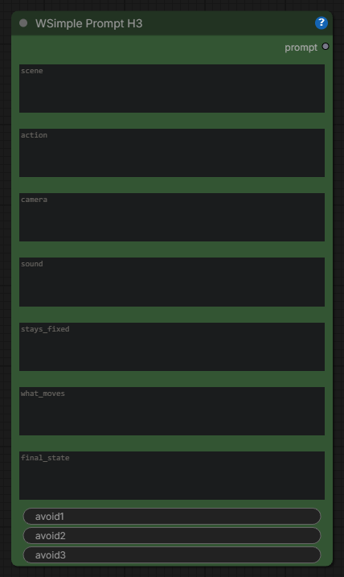

### WScene Composer H3

Turns a storyboard into a **MiniMax H3 prompt with a time-code per beat**, so sound and picture are written together and land where you want them in the clip. Beats can be locked or scaled to the total duration; it also outputs the timing table and the real frame count.


### WScene H3

**One scene as a single object**: the prompt, its duration, the seed, where the clip starts and lands, an optional mid-clip guide, the references, and how it joins the previous scene.


### WScenes Collection H3

Lines up the scenes **in socket order** into the list the loop runs over: the label of a socket is the number the loop gives that scene (`0 · scene`, `1 · scene`…). That order is the film. The sockets grow as you connect, like the slots of WSwitch: unplug a scene in the middle and the ones after it move up; the `+` chip on a row opens an empty socket right below it, to slip a scene in between.


### WLoop Start H3

Decides **which scenes this Run renders** and what the first of them starts from.


### WLoop Scene Conditioning H3

The **whole conditioning for one scene in one node**: text, canvas, first/last frame, guide, references and the motion/audio hand-off from the previous scene.


### WLoop End H3

Closes one iteration of the loop: from the clip just rendered it cuts **the tail the next scene asks for**.


## Made with it: RESONANCE

A ~77 s music video, video and audio generated together shot by shot with MiniMax H3, driven by these nodes and by an AI agent (Claude Code) working part of the loop through Comfy MCP: a world that exists only where sound touches it, five acts around one black riveted-iron skull. Nine `WScene H3` chained end to end, all seeds fixed for reproduction. Entry for the Comfy H3 Sync Sound Community Challenge, September 2026.

- **Watch it**: [RESONANCE on ArtStation](https://www.artstation.com/artwork/Y8BKm6) · the page on the Lab: [w-interaction.com/resonance.html](https://w-interaction.com/resonance.html) (and [wextraui.html](https://w-interaction.com/wextraui.html) for these nodes)
- Technical diary (pipeline, seed table, what H3's prompting will and won't do, the agent/MCP session): [`workflows/RESONANCE.md`](workflows/RESONANCE.md)
- The workflow: [`workflows/MM_H3_Loop_RESONANCE.json`](workflows/MM_H3_Loop_RESONANCE.json)
- Keyframes and references it loads (drop them in `ComfyUI/input`): [`workflows/references/`](workflows/references/)

## Security

What the pack touches, for whoever reviews it:
- **Files:** only under `ComfyUI/output` and `ComfyUI/input` (`src/wxPaths.py` is the single gate: relative paths are resolved there, absolute paths are accepted only inside them, `..` is dropped). WSave Image writes under `output/`, WDifference keeps its diaries in `output/_Wextra/rundiff`. WCheckpoint loads the checkpoint through the core node's code, by a name ComfyUI itself lists. WLoRA reads LoRA files, their header and — read-only, when there is one — the `.rgthree-info.json` next to them, through `folder_paths` only, in the model folders ComfyUI itself lists; nothing is written back next to the LoRA.
- **Network:** none. The pack makes no outbound request of any kind. Its one HTTP route (`/wextraui/lora_tags`, served by ComfyUI itself) answers only for LoRA names ComfyUI lists, from data already on disk.
- **Code:** no `eval`/`exec`, no `subprocess`, no runtime `pip`, nothing obfuscated. `comfy node validate` passes; `python tools/selftest.py` is the pre-push check.

## Built for agents too

Since 0.3.5 the nodes are made to be driven from outside as well as by hand, through the ComfyUI API and [Comfy MCP](https://comfy.org/mcp). Every input is a named slot with a tooltip an agent can read from `object_info`; new inputs arrive optional with a default, so an API export made before them keeps running. `WSave Image` declares every file it writes in `/history` (`images`, like the standard Save Image), and `WDifference` puts the run's diary in the PNG metadata so the file name can stay short and predictable. In `WPrompt Rows` each row is its own slot (`text3`, `on3`), so an agent can touch one line of your prompt and leave the rest alone.

Since 0.3.6 the saved `widgets_values` of every node match its `object_info` inputs one to one (buttons and pickers take no slot), so a positional reader of the workflow file, like comfy-cli's UI-to-API translator or MCP `list_workflow_slots`, pairs each value with the right input. A workflow saved by an older WextraUI is brought in line by `python tools/migrate_outputs.py my.json` (safe to run twice). Before a push, `python tools/selftest.py --comfy <comfy.exe> my.json` runs the same checks from outside the UI: registry lint, `object_info`, the file paired by position with every value type-checked, one small `/prompt` run per node. The rules every change follows are in `DEVELOPING.md`.

## Changes

See [`CHANGELOG.md`](CHANGELOG.md). Retired nodes live on in `src/legacy/`.

---

<p align="center"><sub>A Winteraction Lab product · by <a href="https://github.com/sickbraintwo">sickbrain2</a> · Apache-2.0</sub></p>
