<h1 align="center"></h1>
<p align="center">Extra nodes for ComfyUI, from the Winteraction workbench.<br>
<sub>Six utilities born from real friction, and the scene loop that renders a whole film with MiniMax H3 Sync Sound.</sub></p>

<p align="center">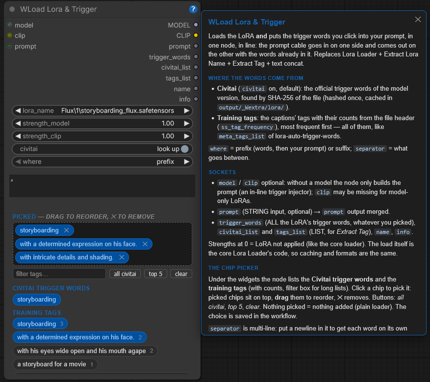</p>
<p align="center"><sub>Every node has a <b>?</b> in its title bar: the full help page, inside ComfyUI. This README is the tour, the <b>?</b> is the manual.</sub></p>

## Install

ComfyUI Manager: search **WextraUI**. Or clone it into your custom nodes:

```
cd ComfyUI/custom_nodes
git clone https://github.com/sickbraintwo/WextraUI
```

No extra dependencies. Restart ComfyUI; the nodes are in the **WextraUI** category.

## The nodes

| Utilities | | H3 scene loop | |
|---|---|---|---|
| [WSave Image](#wsave-image) | file name built from parts | [WSimple Prompt H3](#wsimple-prompt-h3) | prompt without time-codes |
| [WPrompt Rows](#wprompt-rows) | the prompt as rows you switch on and off | [WScene Composer H3](#wscene-composer-h3) | storyboard → time-coded prompt |
| [WRoute](#wroute--wrouteindex) | the *if* that picks an output | [WScene H3](#wscene-h3) | one scene as one object |
| [WRouteIndex](#wroute--wrouteindex) | same, by number | [WScenes Collection H3](#wscenes-collection-h3) | the scenes, in order |
| [WDifference](#wdifference) | what changed since the last run | [WLoop Start H3](#wloop-start-h3) | which scenes this Run renders |
| [WLoad Lora & Trigger](#wload-lora--trigger) | LoRA + trigger words, in line | [WLoop Scene Conditioning H3](#wloop-scene-conditioning-h3) | the loop body |
| [WFrame](#wframe) | crop · resize · place, for outpaint | [WLoop End H3](#wloop-end-h3) | the hand-off to the next scene |

## Utilities

### WSave Image

Saves PNGs with a file name **composed from parts** (folder, subject, any string or number from the graph, a counter of chosen width), the usual ComfyUI metadata embedded. The `preview` box shows the name before you run, linked fields included. `images` is optional: unplugged, the node only composes the name for other savers (video, JSON). The `images` output passes the batch through, so the save sits inside the chain instead of at a dead end. The **write batch** switch appends `_B{batch}{index}`: how many images the run made and which one this is (`_B41`, `_B42`…); the same placeholders work in any text field.

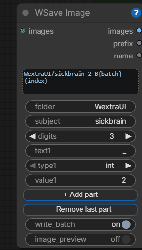

### WPrompt Rows

The prompt as **rows**: each one a text area that grows with the text, an **on/off** chip, and a socket on the left for an external string (trigger words, another prompt) that the same chip switches. **+** adds a row, **−** removes one. The rows that are on come out joined by `, `, a space, a new line or nothing.

### WRoute · WRouteIndex

The **if the other way round**: one input, two outputs, a boolean decides which output carries the value. The branch not chosen **does not run at all**, Save nodes included. `WRouteIndex` does the same with a number and four outputs.

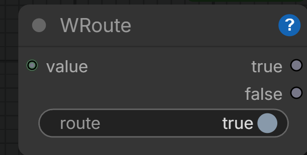 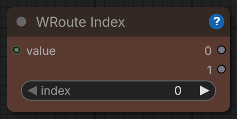

<details><summary>Why it exists, and how to join the branches again</summary>

Nearly every switch in the ecosystem picks an *input*, because ComfyUI is pull-based; this one picks the *output* (`ExecutionBlocker` on the branch not taken). To join the branches back into one Save node use a **lazy** switch fed by the same boolean (core *If/Else Switch*, Easy-Use *if-else*): a non-lazy if (ComfyUI-Logic *If*) evaluates both inputs, meets the blocker and is skipped with everything after it, no error, no file.
</details>

### WDifference

Tells you **what you changed since the previous run** of this workflow: seeds, prompts, widget values, rewiring, nodes added or removed. As text, one line per change, and as a file-name-safe `tag`.

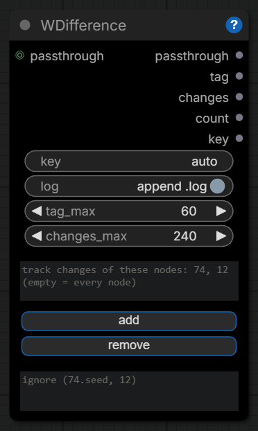

<details><summary>How it works</summary>

It reads the hidden PROMPT that every Save node embeds in the file, keeps the previous run per workflow on disk and returns the differences: `~ Composer I-a (#74) · seed: 2 → 6`, rewiring, nodes added/removed. Optional `.log` = a run diary for free (`output/_Wextra/rundiff/`). `changes` (short, file-name safe: `74.seed→6_12.strength→0.6`) or `tag` (`246.strength=0.4_57.seed=77`, `first`, `same`; display-only widgets ignored) as a string part in WSave Image and the file name tells you what that run changed; the readable diff is in the `.log`.
</details>

### WLoad Lora & Trigger

Loads the LoRA **and** puts the trigger words you click into your prompt, in one node, in line: the prompt cable goes in on one side and comes out on the other with the words already in it. Trigger words come from Civitai (look-up) and from the training tags inside the file; click the chips, drag to reorder. Under the name, the seed-style **control after generate** (`increment` + `lora scope` = any / folder) walks a LoRA family across queued runs; under `strength_model`, a **strength walk** (control / step / until) moves the strength one step per run.

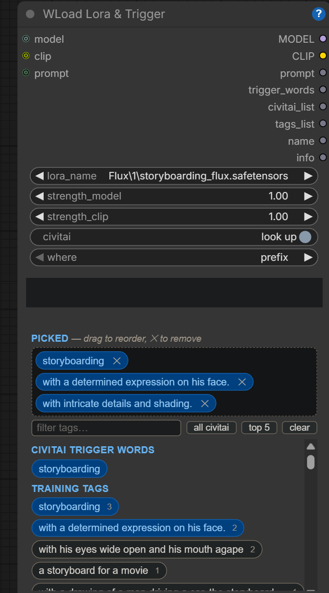

### WFrame

One node for the outpaint prep and every framing job. **`new_width` × `new_height` on top is the master**; then crop (an aspect or custom), resize (fit, cover, long side, short side, or a number) and place on the canvas by anchor and offset: what is missing is padded, what sticks out is cut. Out come the picture, the pad **mask** feathered inward (ready for outpaint), the final size and a short text of what was done.

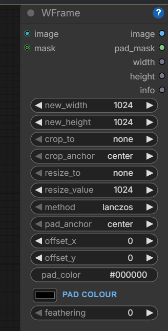

## H3 scene loop

A film for MiniMax H3 Sync Sound as a **list of scenes rendered one after the other**, each clip joined to the previous one by a hand-off of frames and audio. You describe the scenes; the loop renders them, resumes from any point, and lets every scene choose how it joins the one before.

<details><summary>How the hand-off works</summary>

Each **WScene H3** says how it joins the previous one: `handoff_frames` (last N frames + N/24 s of audio of the previous clip anchored at frame 0; valid H3 lengths 5/22/39/56…, 22 = 0.92 s default; longer = more music continuity across the join, more of the previous clip repeated), `previous_from` = `loop` (the clip rendered just before in the same run) or `file` + `resume_from_video` (scene-by-scene work: any clip as the previous one, scene 0 included, so a piece can start from the tail of any video). **WLoop End H3** sits at the end of the loop body and cuts the tail the *next* scene asks for; **WLoop Start H3** only chooses `start_scene` / `scene_count`. A run can therefore mix hand-off lengths per scene and resume anywhere.
</details>

### WSimple Prompt H3

The H3 prompt **without time-codes**: what we see, what happens in order, then the things an H3 prompt must always carry — one camera idea (a still camera said in full), the sound born with the picture, what stays fixed, what moves, the final state, up to three things to avoid. The order of the sentences is the timeline.

### WScene Composer H3

Turns a storyboard into a **MiniMax H3 prompt with a time-code per beat**, so sound and picture are written together and land where you want them in the clip. Beats can be locked or scaled to the total duration; it also outputs the timing table and the real frame count.

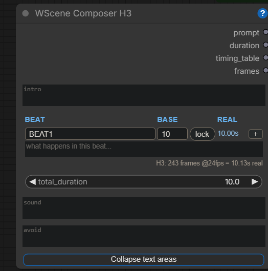

### WScene H3

**One scene as a single object**: the prompt, its duration, the seed, where the clip starts and lands, an optional mid-clip guide, the references, and how it joins the previous scene.

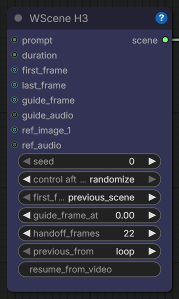

### WScenes Collection H3

Lines up the scenes **in socket order** into the list the loop runs over: `scene1` is scene 0, `scene2` is scene 1, and so on. That order is the film.

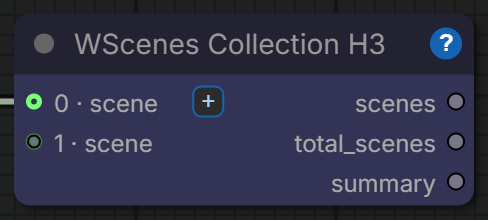

### WLoop Start H3

Decides **which scenes this Run renders** and what the first of them starts from.

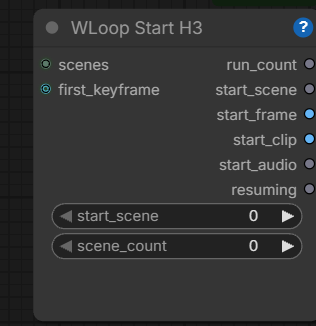

### WLoop Scene Conditioning H3

The **whole conditioning for one scene in one node**: text, canvas, first/last frame, guide, references and the motion/audio hand-off from the previous scene.

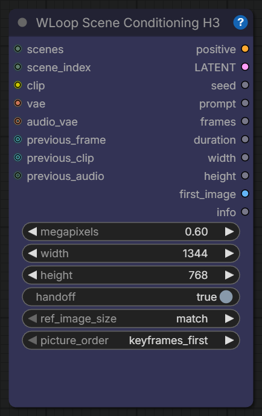

### WLoop End H3

Closes one iteration of the loop: from the clip just rendered it cuts **the tail the next scene asks for**.

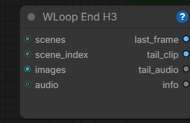

## Made with it: RESONANCE

A ~77 s music video, video and audio generated together shot by shot with MiniMax H3, driven by these nodes and by an AI agent (Claude Code) working part of the loop through Comfy MCP: a world that exists only where sound touches it, five acts around one black riveted-iron skull. Nine `WScene H3` chained end to end, all seeds fixed for reproduction. Entry for the Comfy H3 Sync Sound Community Challenge, September 2026.

- **Watch it**: [RESONANCE on ArtStation](https://www.artstation.com/artwork/Y8BKm6) · the page on the Lab: [w-interaction.com/resonance.html](https://w-interaction.com/resonance.html) (and [wextraui.html](https://w-interaction.com/wextraui.html) for these nodes)
- Technical diary (pipeline, seed table, what H3's prompting will and won't do, the agent/MCP session): [`workflows/RESONANCE.md`](workflows/RESONANCE.md)
- The workflow: [`workflows/MM_H3_Loop_RESONANCE.json`](workflows/MM_H3_Loop_RESONANCE.json)
- Keyframes and references it loads (drop them in `ComfyUI/input`): [`workflows/references/`](workflows/references/)

## Built for agents too

Since 0.3.5 the nodes are made to be driven from outside as well as by hand, through the ComfyUI API and [Comfy MCP](https://comfy.org/mcp): every input is a named slot with a tooltip an agent can read from `object_info`; new inputs arrive optional with a default, so an API export made before them keeps running; `WSave Image` declares every file it writes in `/history` (`images`, like the standard Save Image), and `WDifference` puts the run's diary in the PNG metadata so the file name can stay short and predictable. In `WPrompt Rows` each row is its own slot (`text3`, `on3`), so an agent can touch one line of your prompt and leave the rest alone.

## Changes

See [`CHANGELOG.md`](CHANGELOG.md). Retired nodes live on in `src/legacy/`.

---

<p align="center"><sub>A Winteraction Lab product · by <a href="https://github.com/sickbraintwo">sickbrain2</a> · Apache-2.0</sub></p>
